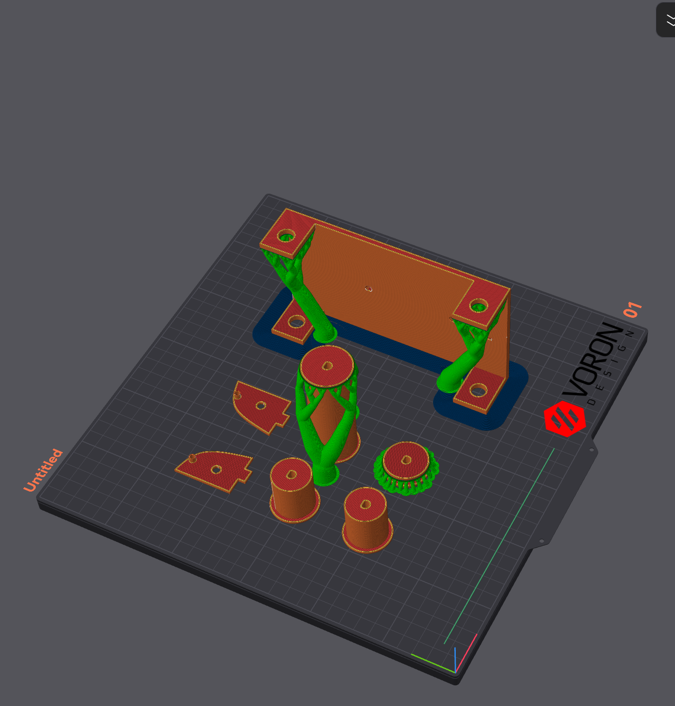

# Filament Storage Box with Passive Respool

- Orient parts as shown in picture
- Paint supports as shown in picture, if not generated
- They are oriented like this and need support is because this is the only way to make reliable , accurate holes (As we all know FDM 3D printers can make better holes in XY-Plane and not in Z-Plane)
- Alternatively, cut the models (The Base, The Idler Roller, and The O-Ring holder) by half, you can print them without support, just sacrifices some strength (Because of combining parts afterwards) and you save a few grams of filament
- 20% infill

## BOM:

| Name           | Quantity      | Specifications                  |
|----------------|---------------|---------------------------------|
| MR105 Bearing  | 4 per channel |                                 |
| MR83 Bearing   | 1 per channel |                                 |
| M3x12 Screw     | 1 per channel |                                 |
| D-shaped shaft | 2 per channel | 90mm length                    |
| O-Ring         | 2 per channel | 30mm outer diameter, 3mm width  |
| Rubber tube    | ~             | 30mm outer diameter, 27mm inner |
| M4x10 Screw    | 8             |                                 |
| M4 Hex Nut     | 8             |                                 |
| M3 Hex Nut     | 1 per channel |                                 |
| Storage Box    | 1             | L40.5, W31.5, H23(cm), Sealed   |

### Note:
- **Buy extra** for the hardware listed above. Screws are usually sold in a pack of 25/50/100, so no worries on that
- The quantity for the rubber tube is not specified, since they are usually sold in meters, and 1 meter will be plenty
- For the o-ring, diameter don't have to be percise since they are flexible, but don't go too far off. The width matters, because that effects how hard it can grip the filament
- For the Rubber tube, diameter don't have to be percise since they are flexible, but don't go too far off
- The box size is for a 4-channel build, try to get the boxes without handle, because they conflicts with the filament spool sometimes
- Maybe considering buying some desiccant, since this is supposed to be a storage box

### Box Modification:
- 2 drilled holes per channel
- You can use the holes on the base plate as a jig
- Use a 5mm drill bit
